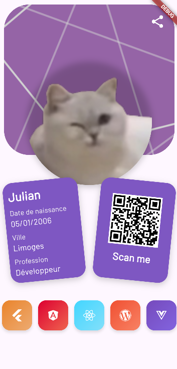

# TP1 - Portfolio Flutter

Premier projet Flutter réalisant une page de portfolio personnelle.

## Fonctionnalités

- Mise en page avec image de fond et photo de profil
- Utilisation de Stack pour superposer les éléments
- Intégration de Google Fonts (Barlow)
- Icônes Font Awesome pour les réseaux sociaux
- Fonctionnalité de partage avec url_launcher
- Design responsive avec des cartes rotatives

## Aperçu

## Technologies utilisées

- Flutter / Dart
- Google Fonts
- Font Awesome Flutter
- URL Launcher
