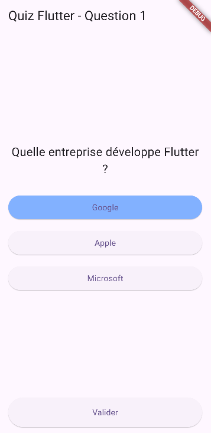

# TP2 - Application Quiz Flutter

Application de quiz interactive avec gestion d'état et navigation entre questions.

## Fonctionnalités

- Quiz interactif avec questions à choix multiples
- Gestion d'état avec StatefulWidget
- Sélection et validation des réponses
- Calcul et affichage du score final
- Navigation entre les questions
- Page de résultats avec récapitulatif

## Aperçu

### Questions

### Résultats

## Concepts Flutter abordés

- StatefulWidget et setState
- Modèles de données (Question, Answer)
- Widgets personnalisés
- Navigation conditionnelle
- Gestion d'événements utilisateur
