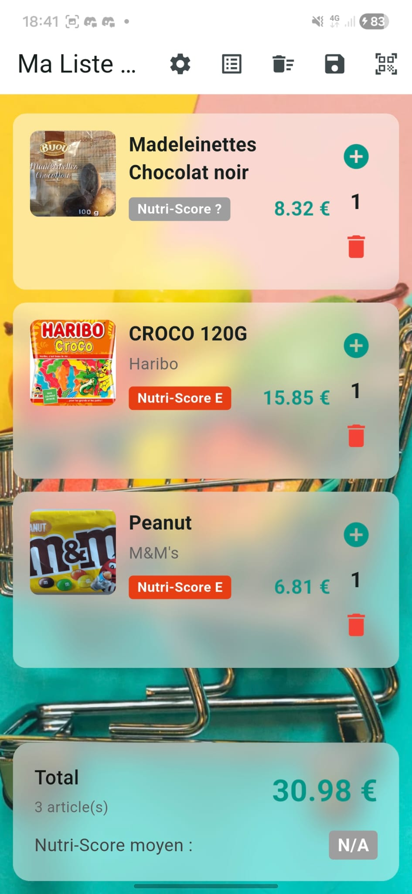
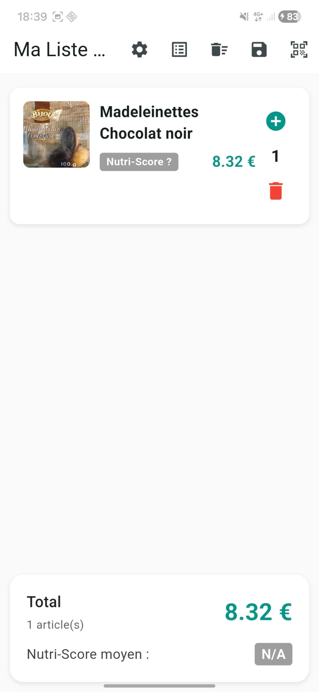
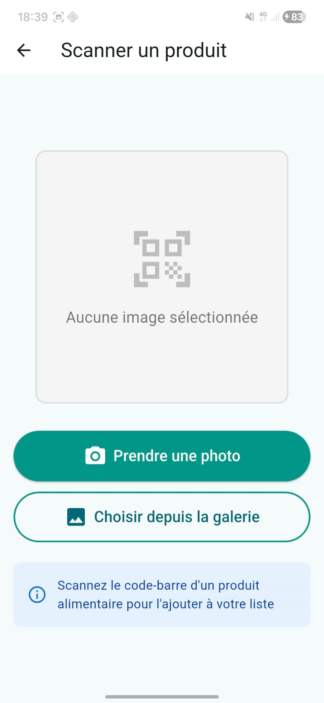
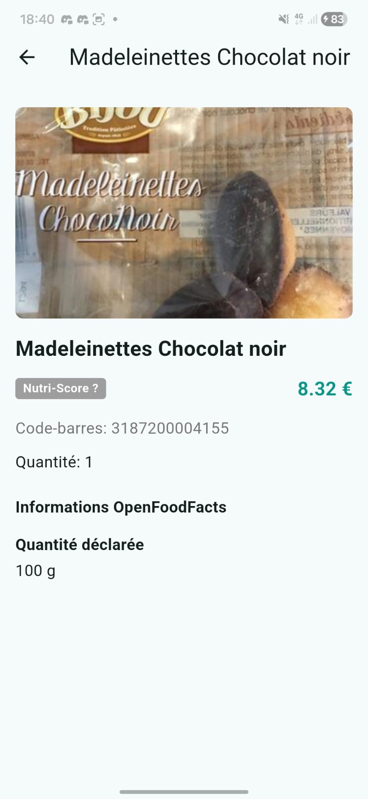
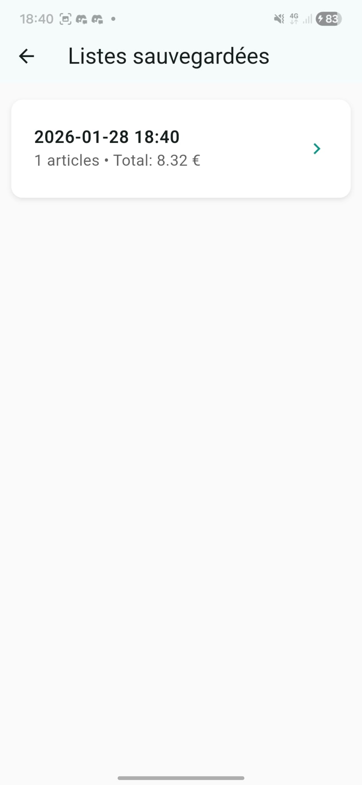
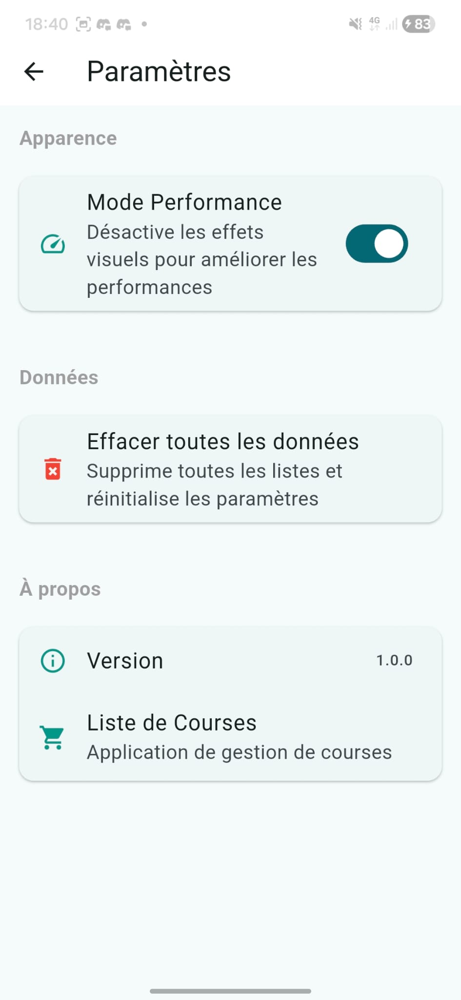

# tp5_doutreligne_julian_valin_mael

Notre projet repose sur une idée simple, pourquoi s'embêter à retenir ou devoir écrire les courses que l'on fait pour avoir le prix, autant utiliser la technologie.

Nous vous proposons, une application, avec laquelle vous pouvez scanner vos articles préférés, et en toute simplicité, regarder le Nutri-Score, le prix, et vous pouvez même sauvegarder votre liste pour une prochaine fois.

Voici **ScanCourse**

## Code utilisé

Cette application a été réalisée avec l'API Flutter comme base de code.
L'API OpenFoodFacts pour la librairie des produits
et l'API .... pour le scan des QR codes


## Amélioration
En plus de pouvoir scanner ses articles, on proposera dans un avenir court, la possibilité de visionner l'intégralité des articles disponibles, afin de faire sa liste avant les courses, de quoi vous simplifier la vie.

Une fonctionnalité vocale vous permettra, à l'aide d'une IA (Coursier) intégrée, de communiquer avec l'application afin de trouver les articles que vous lui demandez.

## Contraintes

## Équipes
Julian Doutreligne
Maël Valin

## screen de l'application


# Nom du Projet

## 👥 Équipe
Julian Doutreligne julian.doutreligne@etu.unilim.fr
Maël Valin mael.valin@etu.unilim.fr

## 📱 Description
Notre projet repose sur une idée simple, pourquoi s'embêter à retenir ou devoir écrire les courses que l'on fait pour avoir le prix, autant utiliser la technologie.

Nous vous proposons, une application, avec laquelle vous pouvez scanner vos articles préférés, et en toute simplicité, regarder le Nutri-Score, le prix, et vous pouvez même sauvegarder votre liste pour une prochaine fois.

Voici **List2Course**

## 🎯 Orientation choisie
Nous avions optez pour le Equilibré.

## ✅ Contraintes respectées
- [x] Consommation d'une API (publique, créée par vous, ou utilisation de Firebase/Supabase)
- [x] Intégration d'au moins un package de pub.dev (hors stockage) pertinent pour votre métier
- [x] Utilisation de stockage persistant (local avec SharedPreferences/Hive/SQLite ou Firebase/Supabase)
- [x] Utilisation d'images (assets locaux ou réseau) de manière cohérente
- [x] Gestion du thème avancé avec mode light et dark (switch dans paramètres, sauvegarde de la préférence, toute l'app s'adapte)

## 🚀 Installation
```
flutter pub get
```
puis lancer le débuggage avec votre téléphone en mode développeur connecté à l'ordinateur

## 🔑 API/Credentials
Pas besoin de clé API

## 📸 Screenshots







## 🎥 Vidéo


